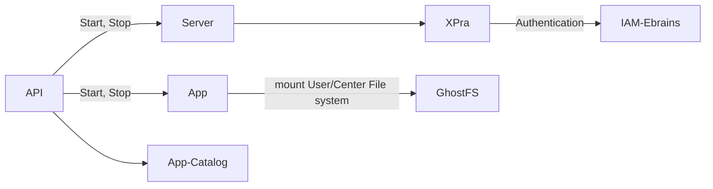
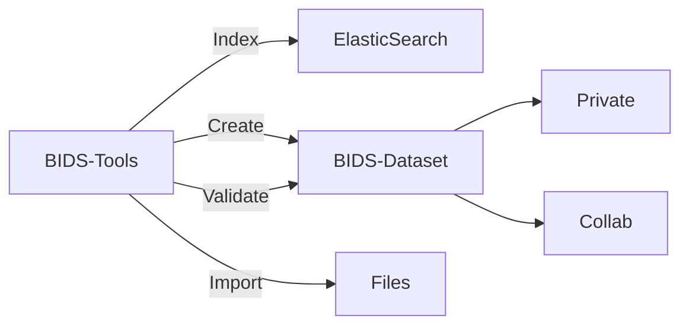
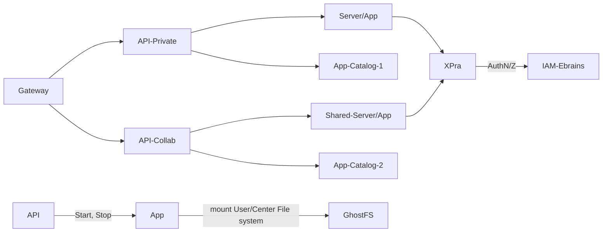
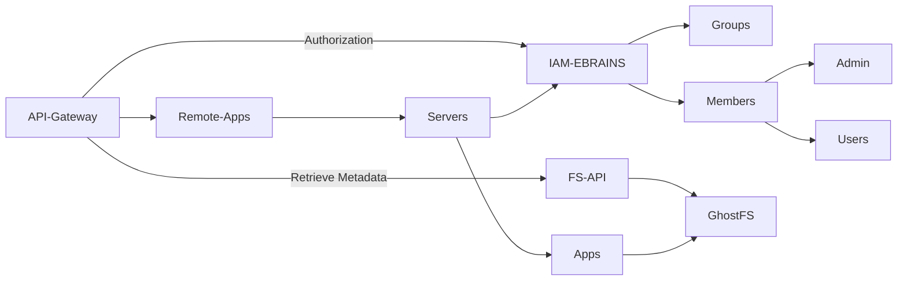
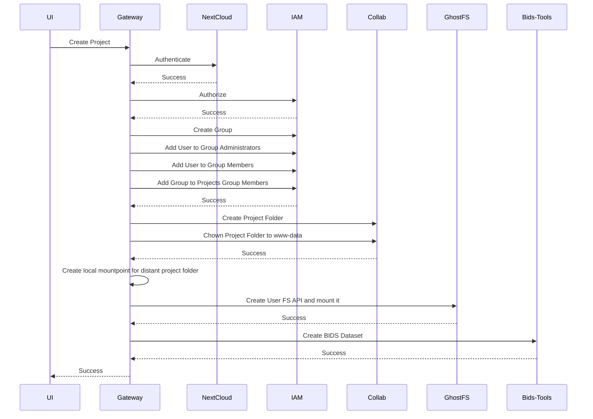

# HIP Architecture
A platform designed for the optimized collection, storage, curation, sharing and analysis of multiscale Human intracerebral EEG data at an international level.

## Collaborative Workspace Release 
May 2023 
A secured, private and dedicated space for projects

## Private Workspace Beta Release 
November 2022  
A secured, private and dedicated space for clinical centers contributing to iEEG data collection to upload, store and process their own pseudonymized data.

https://thehip.app/

### Centers Private Workspace 

#### Nextcloud main features
```mermaid
flowchart LR
Nextcloud --> Login -->|Authentication| IAM-Ebrains
Nextcloud --> FileSystem -->|import files| WebDav
FileSystem -->|import files| WebUI
FileSystem -->|import files| Micromed
Nextcloud --> FileBrowser

````

### Web Interface + API Gateway
```mermaid
flowchart LR
NextCloud --> Web-App
Web-App --> API-Gateway
API-Gateway --> S[(State)]
API-Gateway --> Services
Services --> Remote-App-API
Services --> BIDS-Manager
Services --> AuthN/Z
Web-App --> Centers
Web-App --> Center --> Workspace 
Center --> Desktops
Center --> BIDS
BIDS --> Indexation
```

### Remote Apps


## Projects Collaborative Workspace 
An access-restricted space where curated and pseudonymised data can be shared with other accredited data providers.

https://dev.thehip.app/

### Data Management



### Remote Apps



### Projects


 
#### Create Project 



