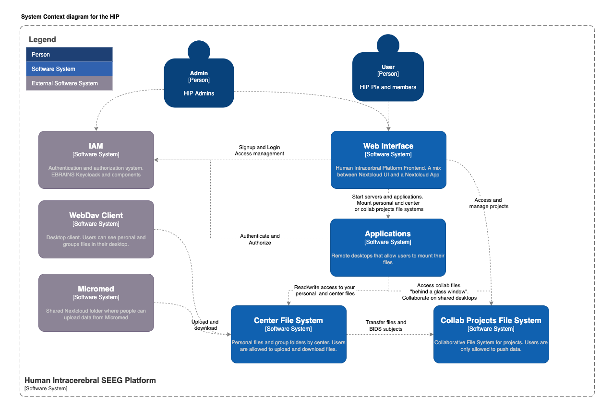
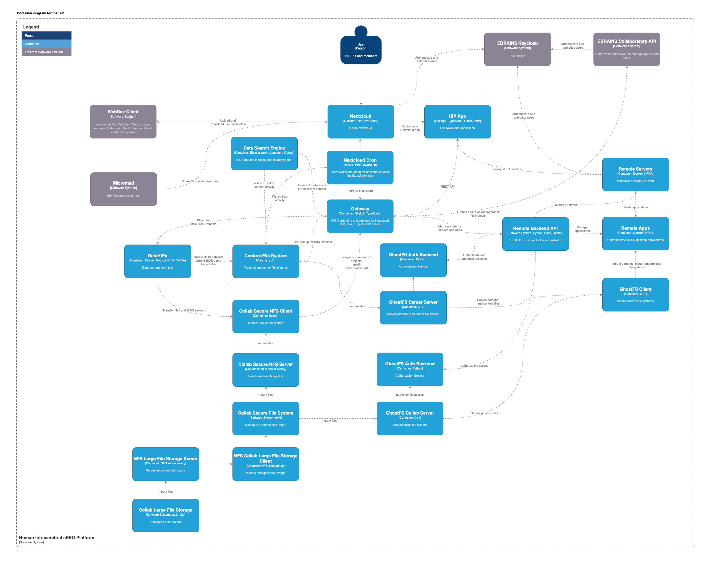

# HIP 

### Summary

The  [HIP](https://thehip.app) (Human Intracerebral sEEG Platform)) is a platform for state-of-the-art processing and international sharing of Human Intracerebral EEG Data. 

More on the [HIP on EBRAINS platform](https://www.ebrains.eu/tools/medical-informatics-platform)

### User documentation   
 [Documentation for HIP users](https://hip-infrastructure.github.io/)

### Software Components

#### App In Browser
app-in-browser allows controlling 3D accelerated graphic sessions in the browser that allow running a set of apps.  
[app-in-browser Github](https://github.com/HIP-infrastructure/app-in-browser)

#### Frontend
Meta package for HIP user facing components and apis: NextCloud, HIP web app and gateway.
[https://github.com/HIP-infrastructure/frontend]()

## Architecture 

Context diagram

Container diagram

## Acknowledgement

This project has received funding from the  European Union's Horizon Europe research and innovation program under grant agreement No 101147319 and from the Swiss State Secretariat for Education, Research and Innovation (SERI) under contract number 23.00638, as part of the Horizon Europe project “EBRAINS 2.0”.

This research was supported by the EBRAINS research infrastructure, funded from the European Union’s Horizon 2020 Framework Programme for Research and Innovation under the Specific Grant Agreement No. 945539 (Human Brain Project SGA3).
