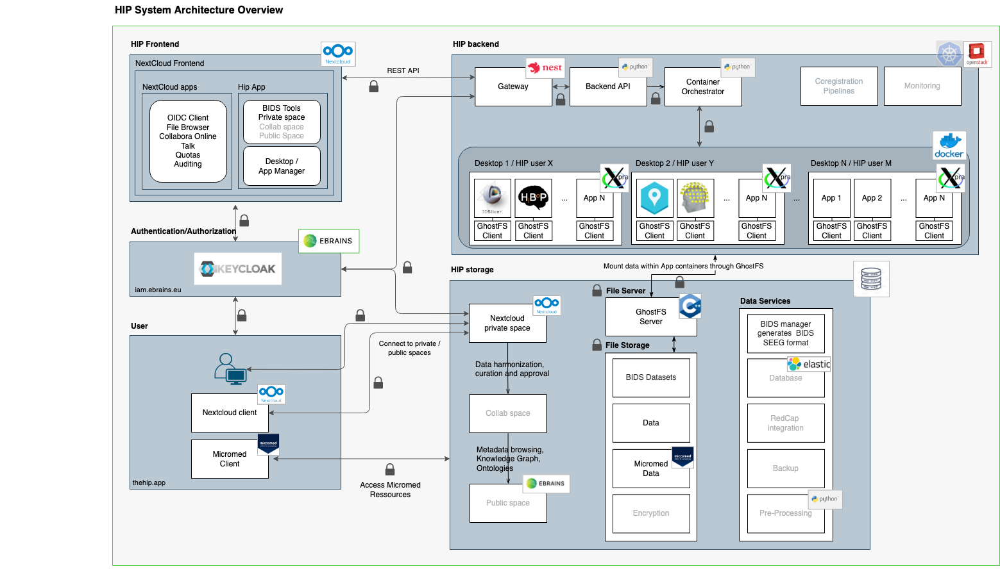

# HIP Documentation

## Summary

The HIP is a platform for state-of-the-art processing and international sharing of Human Intracerebral EEG Data.  

Intracerebral EEG data is sparse, difficult to collect, and their processing or analysis requires domain and IT specific knowledge and resources. Consequently, few standards, methodologies and platforms have emerged to permit the sharing or collaborative use of such data.

Website [Human Intracerebral EEG Platform (HIP)](https://www.humanbrainproject.eu/en/medicine/human-intracerebral-eeg-platform/)

## High Level Overview

- Privacy-aware, distributed compute storage and remote application in display server environment to promote secure collaboration   
- Compliant with ethics and international regulatory frameworks 
- Cross-border sharing of pseudonymised visualised iEEG data, study and ethics protocols, analytical tools, workflows (all applications, including Desktop applications, run as in-browser-apps). 
- Security and closed circuit collaborative functions for data manipulation, analytics, visualisation and processing are preventing data exfiltration

The HIP offers an innovative privacy-enabling data-sharing ecosystem with three defined spaces:
- Personal Space: a secured, access-controlled, private and dedicated space for data providers to upload, store and process their own pseudonymised or anonymised data. Data Green Room and entry-point to the HIP. 
- Collaborative Space: an access-restricted space, where curated and pseudonymised data can explicitly be shared with other accredited HIP Users. 
- Public Space: a space for public, anonymised iEEG data made available to any scientist, findable in the EBRAINS Knowledge Graph. 

The HIP encompasses all aspects of the three tier architecture methodology in its solution as a platform as a service. 

## Components

### App In Browser
app-in-browser allows controlling 3D accelerated graphic sessions in the browser that allow running a set of apps.  
[app-in-browser Github](https://github.com/HIP-infrastructure/app-in-browser)

To be integrated   
https://github.com/manikbh/HIP-doc
- Bids Manager
- Brainstorm
- CCEP
- Freesurfer
- Intranat

- TVB (The Virtual Brain)
  - [HIP TVB app](https://github.com/ins-amu/hip-tvb-app)
  - [TVB Pipeline](https://github.com/ins-amu/tvb-pipeline)
  - [Bayesian Virtual Epileptic Patient](https://github.com/ins-amu/BVEP)

### Frontend
- Meta package for the HIP frontend, which contains 
    - [Gateway](https://github.com/HIP-infrastructure/gateway)
    - [HIP Nextcloud App](https://github.com/HIP-infrastructure/hip)
    - [Nextcloud](https://github.com/HIP-infrastructure/nextcloud-docker)

### Workflows
- [Workflows to be integrated](./workflows.md)

