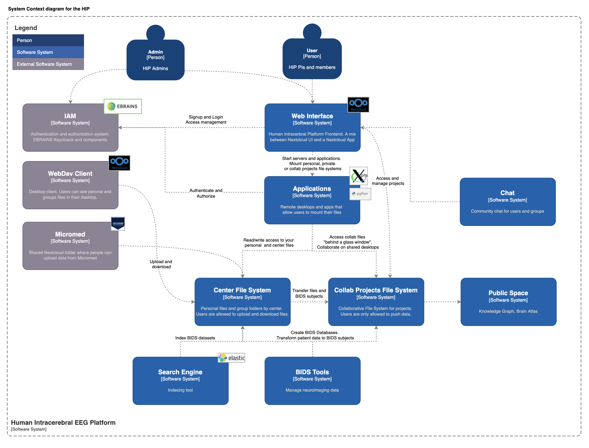

# HIP 

### Summary

The  [HIP](https://thehip.app) (Human Intracerebral sEEG Platform)) is a platform for state-of-the-art processing and international sharing of Human Intracerebral EEG Data. 

More on the [HIP on EBRAINS platform](https://www.ebrains.eu/tools/medical-informatics-platform)

### User documentation   
 [Documentation for HIP users](https://hip-infrastructure.github.io/)

### Software Components

#### App In Browser
app-in-browser allows controlling 3D accelerated graphic sessions in the browser that allow running a set of apps.  
[app-in-browser Github](https://github.com/HIP-infrastructure/app-in-browser)

#### Frontend
Meta package for HIP user facing components and apis: NextCloud, HIP web app and gateway.
[https://github.com/HIP-infrastructure/frontend]()

## Architecture 

Context diagram

Container diagram

