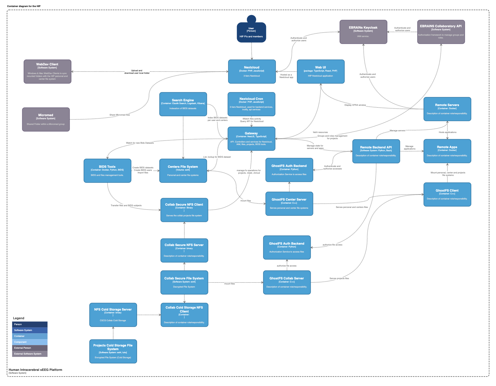

# HIP Technical Documentation

### Summary

The HIP (Human Intracerebral sEEG Platform)) is a platform for state-of-the-art processing and international sharing of Human Intracerebral EEG Data. More on the [HIP Website](https://www.humanbrainproject.eu/en/medicine/human-intracerebral-eeg-platform/)

### User documentation   
 [Documentation for HIP users](https://hip-infrastructure.github.io/) for [thehip.app](https://thehip.app)

### Software Components

#### App In Browser
app-in-browser allows controlling 3D accelerated graphic sessions in the browser that allow running a set of apps.  
[app-in-browser Github](https://github.com/HIP-infrastructure/app-in-browser)

#### Frontend
Meta package for HIP user facing components and apis: NextCloud, HIP web app and gateway.
[https://github.com/HIP-infrastructure/frontend]()

