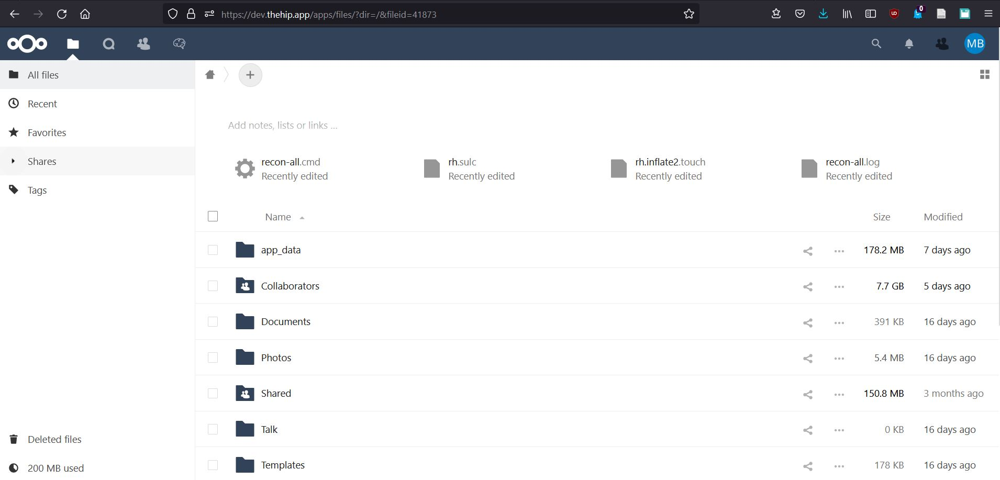
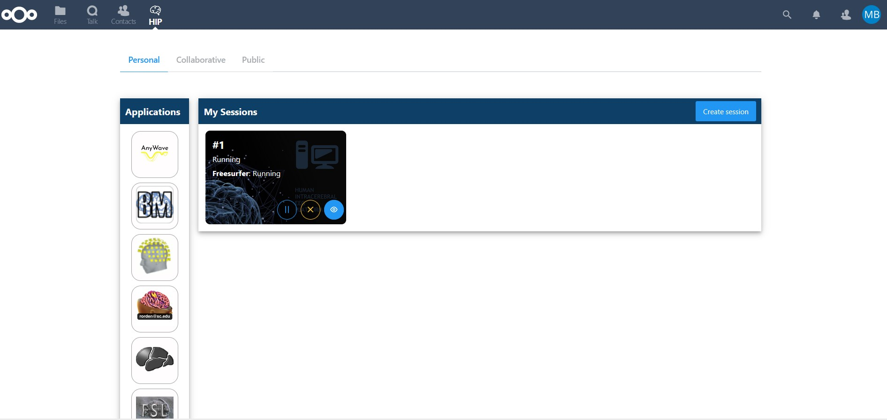
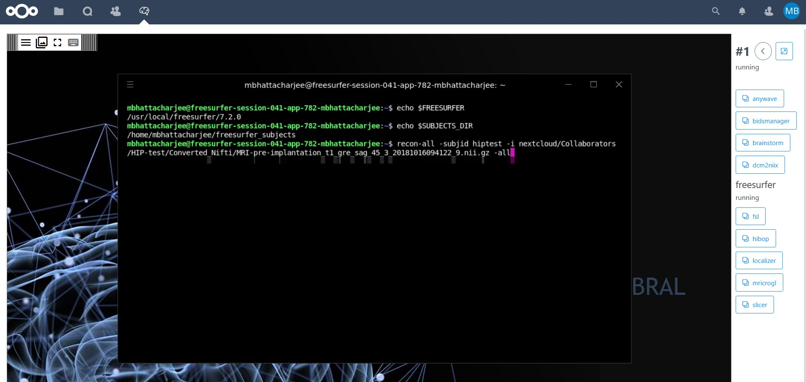

# Freesurfer on the HIP

## Tutorial

This is a tutorial to use [Freesurfer](https://surfer.nmr.mgh.harvard.edu) on the [Human Intracerebral Platform](https://www.humanbrainproject.eu/en/medicine/human-intracerebral-eeg-platform/) of [Human Brain Project](https://www.humanbrainproject.eu)/[eBrains](https://ebrains.eu/).

Freesurfer is developed by the [Laboratory for Computational Neuroimaging](http://martinos.org/lcn/) at the [Athinoula A. Martinos Center for Biomedical Imaging.](http://martinos.org/)

If you use Freesurfer in your research, [use this page to cite the relevant publication](https://surfer.nmr.mgh.harvard.edu/fswiki/FreeSurferMethodsCitation).

1. **Connect to the HIP**. You can manage your files in the default page.

2. On the top line, click on the HIP to **access application sessions**

3. Click on the Freesurfer icon. 

4. You can choose to create a new **session for Freesurfer** or to run it in an existing session (in this example #1)

5. A terminal opens with Freesurfer installed. You can run any Freesurfer command in it (see [Freesurfer's wiki](https://surfer.nmr.mgh.harvard.edu/fswiki/FreeSurferWiki) for more information), e.g. recon-all to process anatomical images.

6. You can also use Freeview command to display an image

The processed data from your subjects will be preserved even after closing sessions in the AppData directory of Freesurfer.

