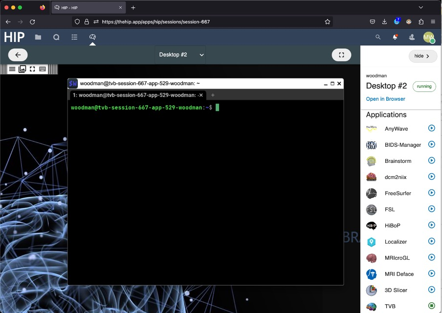
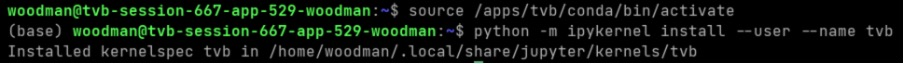
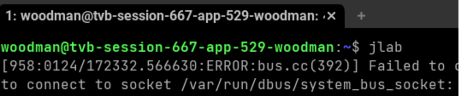
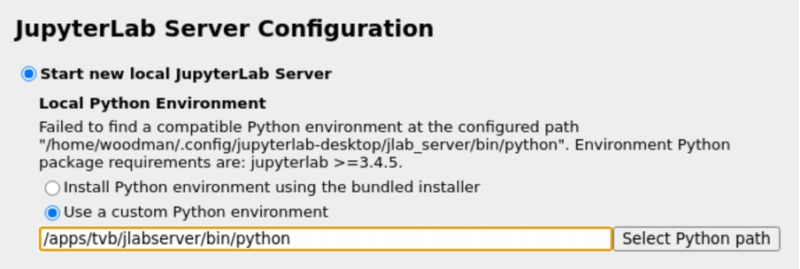
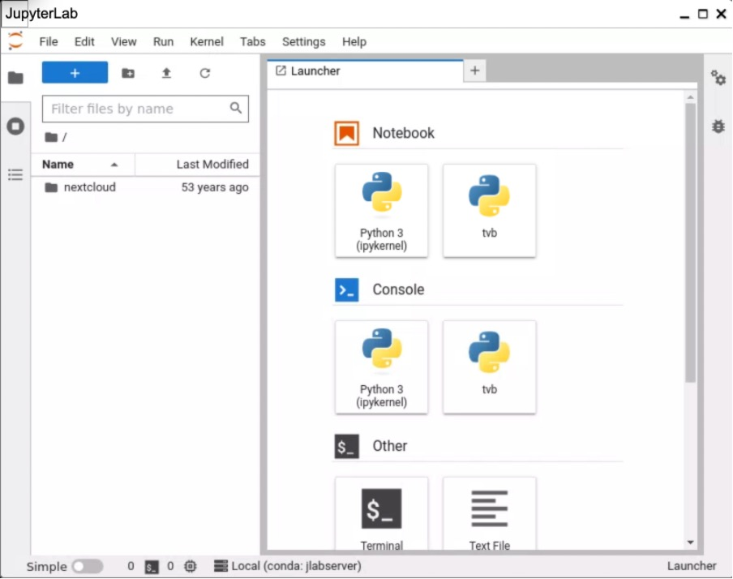

# HIP TVB app

## Setting the app up

Open the TVB app, and a terminal appears first:

The current version requires a setup step to ensure that the TVB libraries
are found: please enter "source /apps/tvb/conda/bin/activate", then
"python -m ipykernel install --user --name tvb":

This step will be automated in the next version of the app. 

## Starting the app

Start JupyerLab interface with the command “jlab” then press Enter

The errors here can be ignored.  

In the current version, the JupyterLab interface needs to be told where to find the Python libraries:  select "Custom path" and enter "/apps/tvb/jlabserver/bin/python":

Then click “Apply and restart”

In the next version, this will be automated for you.  Once jlab starts, you can interact with the notebooks:

The launcher on the right allows starting new notebooks or terminal windows.  The file browser on the left shows files in the current directory, which by default in the home directory, so only the nextcloud folder is available. 

## Next steps

The JupyterLab interface allows you to run notebooks which have access
to the full set of TVB libraries.

A preprocessed dataset run with TVB will be available in the nextcloud shared folder, and a future version will have tutorials on how to preprocess your own datasets. 
