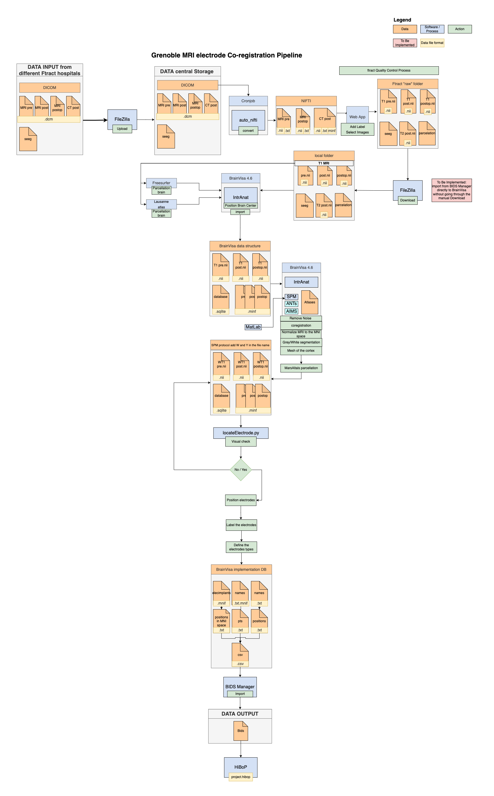
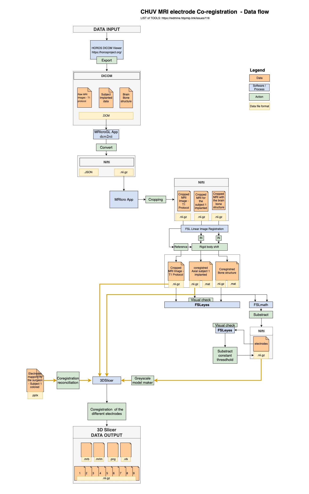

# Workflows

A Command Line Tool is a non-interactive executable program that reads some input, performs a computation, and terminates after producing some output. 

The HIP will integrate a workflow pipeline, like [Common Workflow Language (CWL) Specification](https://www.commonwl.org/v1.2/) to ensure data transformation, validation, between various input and output formats, for example: 

- BIDS manager conversion 
    - to be integrated 
- CHRU Coregistration Pipeline
   - 
- CHUV Coregitration Pipeline  
  - 

[Source document](./docs/HIPArchitectureDesign.drawio) made with [https://www.diagrams.net/](https://www.diagrams.net/)
